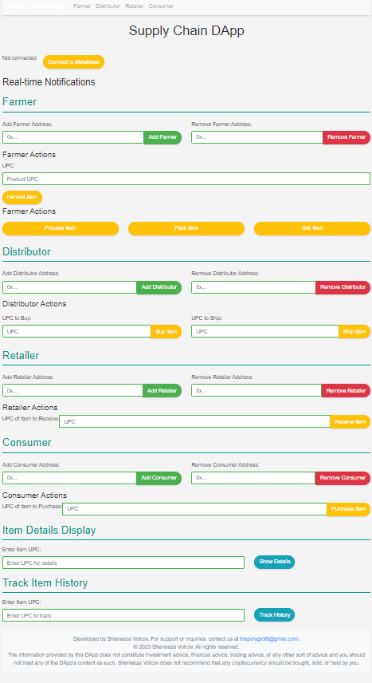
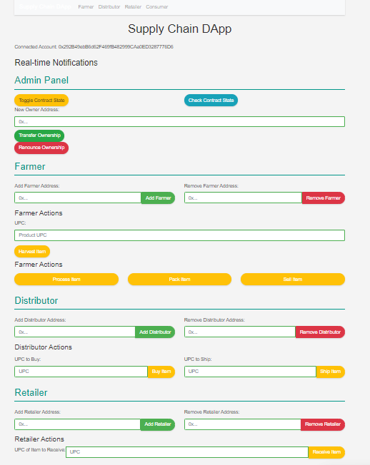

# Supply Chain DApp Frontend


[](LICENSE)
[](https://github.com/blockchaincyberpunk1/coffee-track/stargazers)
[](https://github.com/blockchaincyberpunk1/coffee-track/network/members)
[](https://github.com/blockchaincyberpunk1/coffee-track/issues)
[](https://github.com/blockchaincyberpunk1/coffee-track/pulls)


## Table of Contents

- [Supply Chain DApp Frontend](#supply-chain-dapp-frontend)
  - [Table of Contents](#table-of-contents)
  - [Introduction](#introduction)
  - [Demo](#demo)
  - [Features](#features)
  - [Installation](#installation)
  - [Usage](#usage)
  - [Contributing](#contributing)
  - [License](#license)

## Introduction

The Supply Chain DApp is a blockchain-based decentralized application that provides an efficient and transparent way to track the production, processing, and distribution of products from their origin to the consumer.

## Demo





You can explore a live demo of the Supply Chain DApp [here](https://supplychaindapp.example.com).


## Features

The Supply Chain DApp offers a range of functionalities:

- **Track Product Journey**: From the farmer to the consumer, track the entire journey of a product.
- **Role Management**: Assign roles like Farmer, Distributor, Retailer, and Consumer within the supply chain.
- **Real-Time Notifications**: Receive updates on each step of the product’s journey.
- **Smart Contract Interactions**: Seamless integration with Ethereum blockchain for transparent transactions.
- **User-Friendly Interface**: Easy to navigate and interact with the various stages of the supply chain.

For a comprehensive list of features and how to use them, please refer to the [Project Overview](Project-Overview.md).

## Installation

To get started with the Supply Chain DApp frontend:

1. Clone the repository:

   ```bash
   git clone https://github.com/blockchaincyberpunk1/coffee-track.git
   ```

2. Navigate to the frontend directory:

   ```bash
   cd coffee-track/frontend
   ```

3. Install dependencies:

   ```bash
   npm install
   ```

4. Open the index.html file in a browser or set up a local server.


For more detailed installation instructions, including prerequisites and troubleshooting tips, see the [Installation Guide](Installation.md).

## Usage

The Supply Chain DApp is intuitive and easy to use. For detailed instructions on how to interact with the different components of the DApp, check out our [User Guide](User-Guide.md). 

## Contributing

Your contributions are welcome! If you'd like to help improve the Supply Chain DApp, please read our [Contribution Guidelines](CONTRIBUTING.md) for a smooth collaboration process.

## License

This project is licensed under the MIT License - see the [LICENSE](LICENSE) file for details.

